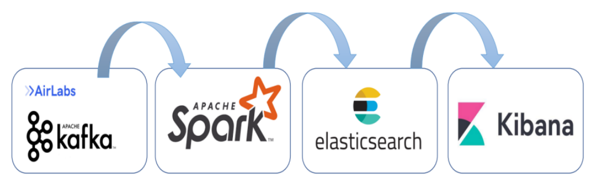

# Kafka-Spark-Integration
This project  will  allows real-time visualization of the status of bike stations with the number of available bikes. This enables users to target stations for bike pickup or drop-off, as well as providing insights for station managers.

## Technologies Used

- Apache Kafka: 3.6.0
- Apache Spark: 3.2.4
- Elasticsearch: 8.8.2
- kibana : 8.8.2
- Scala: 2.12.15

## Project Architecture

Description of the project architecture:

- **Kafka**: Used for real-time streaming of bike station data.
- **Spark**: Processes and analyzes the streaming data from Kafka for real-time insights.
- **Elasticsearch**: Stores the processed data for efficient querying and visualization.

